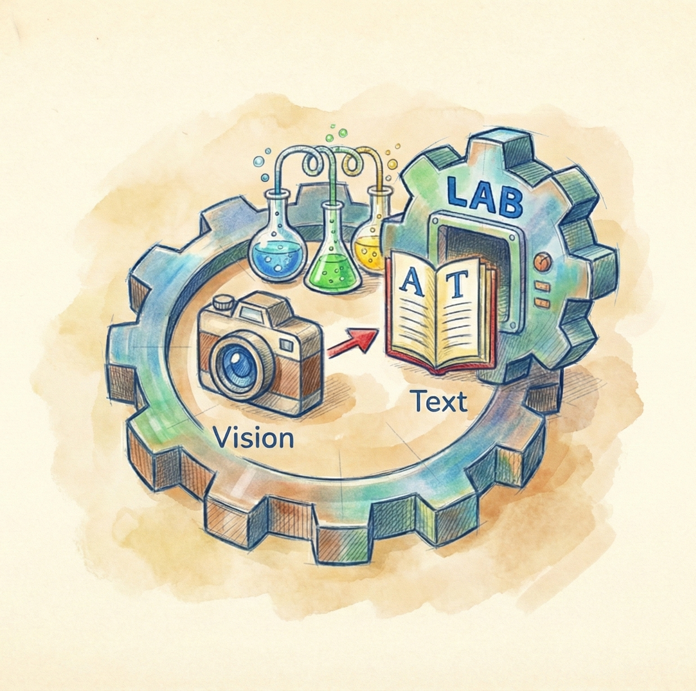

<div align="center">



# NanoVLM-Lab

<i>Advanced Training Framework for Small Vision-Language Models</i>

</div>

---

## 🎯 Overview

**NanoVLM-Lab** is a comprehensive training framework for fine-tuning nanoVLM models with multiple preference optimization and supervised learning approaches. It provides implementations of **SFT (Supervised Fine-Tuning)**, **DPO (Direct Preference Optimization)**, and **GRPO (Group Relative Policy Optimization)** trainers, adapted specifically for nanoVLM's architecture.

This framework is designed for researchers and practitioners who want to:
- Quickly test and validate research hypotheses on efficient vision-language models
- Fine-tune nanoVLM on domain-specific tasks without the overhead of large models
- Implement cutting-edge alignment techniques (DPO, GRPO, GSPO, DAPO) with minimal complexity

---

## 💡 Motivation

**NanoVLM-Lab** addresses a critical gap in the ML research ecosystem:

- **Efficient Research on Small Models**: Test your hypotheses on nanoVLM (a lightweight, efficient VLM) instead of resource-heavy models like Qwen or Gemma. This enables faster iteration and lower computational costs.
- **Academic-Friendly**: Perfect for researchers with limited GPU resources who still want to implement and validate hypotheses.
- **Rapid Hypothesis Testing**: The framework's modular design and example notebooks allow you to test ideas in hours, not days.
- **Scalability**: Start small with nanoVLM, then scale your approach to larger models with confidence.

---

## ✨ Features

* 🎯 **Multiple Training Approaches**
  - Supervised Fine-Tuning (SFT) for standard supervised learning
  - Direct Preference Optimization (DPO) for preference-based alignment
  - Group Relative Policy Optimization (GRPO) with GSPO and DAPO variants
* 📊 **Flexible Dataset Handling** — support for image-text pairs and preference datasets
* 🚀 **HuggingFace-Powered** — built on top of HuggingFace's Transformers and TRL implementations
* ⚡ **Efficient Training** — optimized for single and multi-GPU setups
* 📝 **Example Jupyter Notebooks** — complete end-to-end examples for each trainer
* 🔧 **Easy Integration** — drop-in replacement for standard training pipelines

---

## 📸 Examples using NanoVLM Lab

### DPO Example

Below is a real example of how DPO preference tuning improves model outputs:

| Image | Prompt | Pre-trained nanoVLM Output* | DPO Preference-Tuned Output** |
|-------|--------|---------------------------|------------------------------|
|  | "Why are cakes usually eaten at party's?" | "birthday" | "Cakes are usually eaten at parties to celebrate and to commemorate special occasions, such as birthdays, anniversaries, or holidays. The festive atmosphere and shared enjoyment create the ideal setting for cakes to be a highlight of the event." |

*After short training on a subset of the dataset using DPO preference optimization.<br>
** Using the checkpoint: lusxvr/nanoVLM-230M-8k

---

## 📦 Installation

### Step 1: Clone NanoVLM-Lab

```bash
git clone https://github.com/huggingface/nanoVLM.git && \
mv nanoVLM/ RL-VLM-Lab/nanovlm && \
mv RL-VLM-Lab/rlvlm/datasets.py RL-VLM-Lab/rlvlm/collators.py RL-VLM-Lab/nanovlm/data/
```

### Step 2: Clone nanoVLM Repository

Clone the original nanoVLM repository and place it in the root of the NanoVLM-Lab directory:

```bash
git clone https://github.com/huggingface/nanoVLM.git
```

Your project structure should look like this:

```
nanovlm-lab/
├── nanoVLM/                    
├── configs/                     
├── examples/                    
├── rlvlm/                       
├── requirements.txt
└── setup.py
```

### Step 3: Install Dependencies

```bash
pip install -e .
```
---

## 🚀 Quick Start

Train a nanoVLM model with a single command! NanoVLM-Lab uses YAML configuration files to define all training parameters.

```bash
python rlvlm/main.py --config configs/sft_config.yaml
python rlvlm/main.py --config configs/dpo_config.yaml
python rlvlm/main.py --config configs/grpo_config.yaml
```

### Interactive Exploration

For interactive exploration and debugging, check out the example notebooks in the [`examples/`](examples/) folder:
- `nanovlm_sft.ipynb` — Supervised Fine-Tuning
- `nanovlm_dpo.ipynb` — Direct Preference Optimization
- `nanovlm_grpo.ipynb` — Group Relative Policy Optimization

### Configuration

All training parameters are defined in YAML config files. See [`configs/README.md`](configs/README.md) for:
- Complete list of configuration options
- Dataset format specifications
- Example configurations for each training approach

---

## 📚 Documentation

Comprehensive guides for using NanoVLM-Lab:

- **[Configuration Guide](configs/README.md)** — Complete list of configuration options, dataset formats, and example configs
- **[Training Approaches](examples/README.md)** — Detailed overview of SFT, DPO, and GRPO training methods
- **[Example Notebooks](examples/)** — Interactive Jupyter notebooks for each training approach

---

## 🤝 Contributing

Contributions are welcome! Please:

1. Fork the repository
2. Create a feature branch (`git checkout -b feature/amazing-feature`)
3. Commit changes (`git commit -m 'Add amazing feature'`)
4. Push to branch (`git push origin feature/amazing-feature`)
5. Open a Pull Request

For major changes, please open an issue first to discuss proposed changes.

---

## Citation

If you find NanoVLM-Lab useful in your research, please consider citing it:

```bibtex
@software{nanovlm_lab,
  title={NanoVLM-Lab: Advanced Training Framework for Small Vision-Language Models},
  author={Akash Kamalesh},
  year={2025},
  url={https://github.com/akash-kamalesh/nanovlm-lab}
}
```
---

## License

MIT License. See `LICENSE` file for details.

---